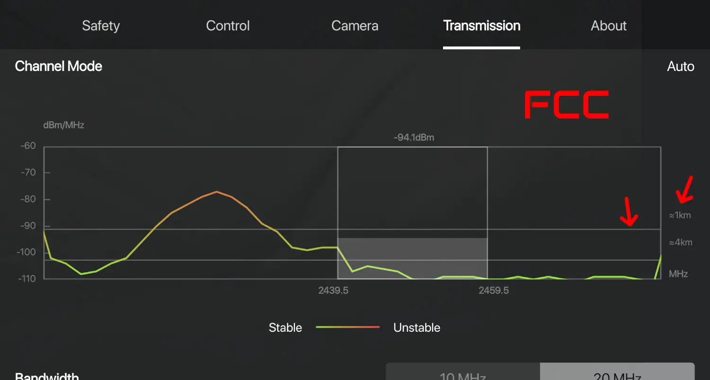
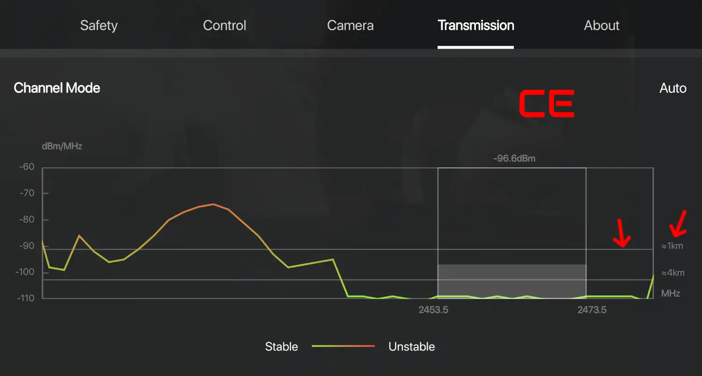

<div align="center">

# SkylabFCCfree

### Open-source FCC unlock for DJI smart controllers with a screen

[](LICENSE)
[](https://github.com/danusha2345/SkylabFCCfree/releases)
[](https://boosty.to/danusha/donate)

A free and open-source Android app that unlocks FCC mode, sends experimental 4G activation frames, and queries device info on DJI smart controllers with a screen (RC2, RC Pro 2, RC Plus). No external backend, paid activation, or tracking. Commands run locally from inspectable JSON profiles.

</div>

---

> ## Disclaimer
>
> This software is provided for educational and research purposes only. Modifying radio transmission parameters may violate laws and regulations in your country or region. In most places, increasing radio power beyond what is legally permitted for your area requires authorization from the relevant regulatory authority.
>
> You are solely responsible for ensuring that your use of this software complies with all applicable local, regional, and national laws. The author of this project accepts no liability for any damage, legal consequences, or regulatory action arising from the use of this tool.
>
> Use only if you have proper authorization to operate in FCC mode in your jurisdiction. If you are unsure whether this is legal where you live, do not use it.
>
> This project is not affiliated with, endorsed by, or sponsored by DJI. Using this tool may void your warranty and DJI Care Refresh coverage.

---

## Features

| Feature | Description |
|---------|-------------|
| **FCC Unlock** | Switches the radio from CE to FCC mode for higher power and more channels |
| **4G Activation** | Sends 4G activation frames to the aircraft (serial read at runtime) — no status readback, experimental |
| **GPS Control** | Reads the master `gps_enable` state and provides experimental explicit ON/OFF commands with one-shot readback |
| **LED Control** | Reads the current lamp state and verifies it after LED on/off commands (DJI Fly and a linked aircraft are required) |
| **Device Info** | Shows app version, controller code, aircraft model code, factory S/N, and LAN bridge address |
| **Auto FCC** | Saves one of two optional startup modes: repeated DJI Fly Home Point detection or the original four-frame keepalive every five seconds |
| **Persistent Status** | Shows a foreground notification and starts the app service automatically after controller boot without sending FCC commands |
| **Auto-Updater** | Checks `danusha2345/SkylabFCCfree` GitHub Releases and lets you download/install from the app |
| **LAN Diagnostic API** | Logs, live status, bounded OpenFCC/DJI `logcat`, one-shot localhost socket inventory, allowlisted app actions, and raw DUML request/response over HTTP on the controller's RFC1918 Wi-Fi address |
| **Local by default** | Internet is used for update checks/downloads; the LAN API stays inside the current Wi-Fi subnet and can be disabled in the Log tab |
| **Open Profiles** | Command frames are plain JSON files you can inspect and edit |
| **No Paid Activation** | No trial, tracking, or external licensing backend |

> **Note on altitude/distance/NFZ unlock:** This is **not possible** via DUML commands alone. The 120m CE altitude limit is enforced by the **DJI Fly app** via a C0 class runtime flag that overrides flight controller parameters on every connection. No FCC unlock app can bypass this — it requires modifying the DJI Fly app itself or flashing patched firmware. DUML parameter writes (cmd_set=3, cmd_id=0xF9) set the FC values, but the Fly app overrides them on every reconnect. There are three separate altitude layers (C0 class cap from the Fly app, no-GPS/ATTI ceiling from firmware, novice/beginner mode from firmware); only the firmware layers are DUML-addressable, and only the C0 class cap is the 120m limit users actually hit. There is no known way to bypass the C0 cap without modifying the DJI Fly app or flashing patched firmware.

## Download

| Download | Link |
|----------|------|
| SkylabFCCfree App (APK) | [GitHub Releases](https://github.com/danusha2345/SkylabFCCfree/releases) |
| Helper Apps (zip) | [freefcc.duckdns.org/downloads/freefcc-helpers.zip](https://freefcc.duckdns.org/downloads/freefcc-helpers.zip) |

Release changes are tracked in [CHANGELOG.md](CHANGELOG.md).

For the RC2 SD-card installation below, download both the APK and the helper
archive. The guide uses `01_PackageInstaller`, `02_FileManager`, and
`03_ATVLauncher`. `04_Edge Gestures` is no longer required and can be ignored.

> `01_PackageInstaller` and `02_FileManager` are DJI-signed copies of the
> controller's Android system packages. `03_ATVLauncher` is a third-party
> launcher. Exact hashes, OTA matches and the remaining redistribution caveat
> are documented in [Helper APK provenance](docs/HELPER_APK_PROVENANCE.md).

## Compatibility

This fork has current live validation on DJI RC2. Upstream reports also cover RC Pro 2 and RC Plus RM700. The separate [freefcc-launcher](https://github.com/doesthings/freefcc-launcher) is an optional Windows USB/ADB installer for controllers without the RC2 SD-card workflow. Its additional RC Pro 2 firmware-swap path for 4G is explicitly unverified and is not required by FreeFCC itself.

| Drone | Controller | FCC | 4G | LED | Status |
|-------|-----------|-----|-----|-----|--------|
| DJI Mini 5 Pro | RC2 | Yes | No (no cellular module) | Yes | FCC + LED working |
| DJI Mini 4 Pro | RC2 | Yes | No (no cellular module) | Not tested | FCC working |
| DJI Mavic 4 Pro | RC Pro 2 | Yes | Yes (Cellular Dongle 2) | Not tested | FCC working |
| DJI Air 3S | RC2 | Yes | No (no cellular module) | Not tested | FCC working |
| DJI Neo 1 | RC2 | Yes | No (no cellular module) | Not tested | FCC working |
| DJI Neo 2 | RC2 | Yes | No (no cellular module) | Not tested | FCC working |
| DJI Avata 360 Enhanced Transmission edition | RC2 | Yes | Unknown (integrated IoT eSIM; testing required) | Yes | FCC + LED working; 4G endpoint reachable, profile unverified |
| DJI M30T | RC Plus RM700 | Reported working | Reported working | Reported working | [Upstream hardware report](https://github.com/doesthings/FreeFCC/issues/18); firmware details not supplied |
| DJI Matrice 350 | RC Plus | Expected, untested | Cellular hardware supported; profile unverified | Not tested | Hardware verification required |
| DJI Inspire 3 | RC Plus | Expected, untested | Cellular hardware supported; profile unverified | Not tested | Hardware verification required |
| Other RC2 aircraft | RC2 | Should work | Unknown | Unknown | FCC profile is universal |

The captured 4G profile is experimental and was derived from systems using external cellular hardware. DJI Avata 360 Enhanced Transmission edition instead has an integrated IoT eSIM module. FreeFCC can probe whether the controller exposes `/duss/mb/0x205`, but endpoint availability does not prove that the same 128-frame activation sequence is compatible. An explicit experimental send accepts a freshly observed full `1581...` serial or structurally valid `WA/WM` identity; there is no model allowlist.

Validated upstream on DJI RC2 firmware v10.00.0700; this fork was additionally exercised live on RC2 `rc331`. Future firmware can change the local proxy or DUML routing, so compatibility must be rechecked rather than assumed.

The FCC page always keeps the same compact `2×2` control grid. The two Auto FCC
switches are on the left; **Send FCC Request** and the highlighted
**Open DJI Fly** action are on the right. The switches are mutually exclusive,
but both may be off. The selected switch is highlighted in green, saved, and
restored when the app starts after controller boot or an APK update.

**Auto FCC — Home Point** waits for localized Home Point text from the original
DJI Fly through Android Accessibility. It does not open a DUML socket while
waiting. After an exact phrase match it connects to the controller if needed and
sends the complete 21-frame × 2-round FCC profile. It then re-arms instead of
stopping, so a later Home Point after an aircraft battery replacement triggers
another full apply while the controller remains on. Duplicate UI events are
debounced for 30 seconds. Enable **SkylabFCCfree Home Point Test** once in
Android Accessibility settings. The first attempt opens the required settings;
after the service is enabled and you return to SkylabFCCfree, the mode starts.

**Auto FCC — every 5 sec** is the explicit legacy alternative. It sends the
complete profile once, then sends the original upstream four-frame
`fcc_keepalive.json` every five seconds until its switch is turned off.
On a resource-constrained controller, prefer **Home Point**: while armed it is
event-driven and does not perform periodic DUML/TCP work. The five-second mode
wakes the service and makes four short frame writes per tick—48 writes per
minute, or 2,880 per hour—so its CPU, I/O, and battery cost is small but
continuous. The persistent status notification itself does not poll.
**Send FCC Request** remains a one-shot manual full-profile action. Neither
automatic mode nor the manual action opens DJI Fly; only **Open DJI Fly** does.

If you test it on a model or firmware version not listed here, please [open an issue](https://github.com/danusha2345/SkylabFCCfree/issues) and let me know.

## Install Guide

The original flow was tested on Mini 5 Pro with RC2 firmware v10.00.0700. No PC is needed. The repository README is the maintained installation guide; the older `freefcc.duckdns.org` page is not currently authoritative.

### 1. Prep the SD card

**Format the microSD card in the RC2 first.** Insert the card into the controller, then go to the RC2's storage settings and format it. If you skip this, the RC2 won't let you browse files on the card.

Download the helper apps zip and the SkylabFCCfree APK. Extract the zip, drop the APK into the extracted folder, then move the whole thing onto the microSD card. Stick the card into your RC2.

> The RC2 won't install apps from internal storage, only from the SD card. The card must be formatted in the controller itself before it can be browsed.

### 2. Install the helper apps

Swipe down from the top of the RC2 screen, tap the SD card notification, hit EXPLORE, and open your folder. Install these two without opening them:

- `01_PackageInstaller` - tap it, CONTINUE, INSTALL, DONE
- `02_FileManager` - same thing

### 3. Restart

Hold the power button to shut down, then power back on. This registers the package installer.

### 4. Install the launcher

Back into your folder on the SD card. Install `03_ATVLauncher`, then tap
**OPEN**.

### 5. Install SkylabFCCfree

In ATV Launcher, open **Files**, find your folder, tap the SkylabFCCfree APK,
and install it. Tap **OPEN** once after installation so Android enables its
boot receiver and the app can create its persistent status notification.

`04_Edge Gestures` is not needed. On later controller boots SkylabFCCfree starts
its background service automatically. Tap its persistent notification to open
the app and use **Open DJI Fly** to enter DJI Fly.

## How to Use

On the first **Auto FCC — Home Point** run, the button opens Android
Accessibility settings automatically. Enable **SkylabFCCfree Home Point Test** and
return to SkylabFCCfree; the pending text-based mode starts automatically. The
service reads only accessibility events and visible text from `dji.go.v5`, and
loads Home Point phrases from every locale present in the installed DJI Fly.
Reading the screen does not open DUML; an armed Home Point match triggers one
full FCC apply.

1. Power on the drone and link it to the controller
2. Turn on **Auto FCC — Home Point**, turn on **Auto FCC — every 5 sec**, or use the one-shot **Send FCC Request**. Turning one switch on turns the other off; turning the active switch off leaves both off.
3. Open DJI Fly only with **Open DJI Fly**. Home Point mode remains armed and sends the full profile after every new flight-session Home Point, including after replacing the aircraft battery without restarting the controller. Five-second mode sends the full profile once and then the original four-frame keepalive until its switch is turned off.
4. For 4G diagnostics, tap **Probe 4G Endpoint** first. This is read-only and only checks whether `/duss/mb/0x205` is reachable. **Send 4G Activation Frames** remains experimental and confirms writes only, not activation.
   > **Note:** The integrated eSIM path on DJI Avata 360 is not yet proven compatible with the captured external-module profile. Please attach the LAN logs to an [issue](https://github.com/danusha2345/SkylabFCCfree/issues) when testing.
5. The aircraft-control card is split evenly: GPS on the left and LED on the right. Each side has its own manual refresh and explicit ON/OFF buttons, available without starting Auto FCC first. GPS ON/OFF sends five bounded idempotent writes 100 ms apart, releases port `40007`, and after 250 ms automatically runs a three-attempt status Refresh. Every status attempt opens a new port lease instead of reusing a failed one. LED ON/OFF makes at most two complete reference-pattern command cycles. GPS/LED stay on the wrapped `40007` path because live RC Pro 2 tests found no matching readback on `40009` or `8901`. The last validated replies persist across app reopen with a `Last verified` timestamp, and a failed manual refresh does not erase them. A GPS write invalidates the older cached value until the fresh Refresh completes, so the UI never presents the pre-command OFF/ON as current. Neither side polls port `40007` in the background.
6. The **Info** tab lets you query the controller's hardware and firmware version
7. The **Log** tab starts the LAN diagnostic API by default. It uses unencrypted HTTP and a fixed shared password. A UDP beacon broadcasts only the controller IP and port across the current Wi-Fi subnet; it does not include the password, logs, or command payloads. Disable the bridge on untrusted Wi-Fi. See [LAN Control API](docs/LAN_CONTROL_API.md) and the evidence-based [RC2 port and stream map](docs/RC2_PORT_AND_STREAM_MAP.md).

SkylabFCCfree also keeps a low-priority foreground notification visible while
the controller is running. The service starts after controller boot and after
an in-place APK update. If an Auto FCC switch was selected, that mode is
restored without opening DJI Fly; if both switches were off, no FCC command is
started. The notification shows **Home Point**, **every 5 seconds**, or **Off**
and exposes all three choices as actions, so the mode can be changed without
opening the app. Selecting Home Point opens Android Accessibility settings when
the required service is not enabled yet. Tap the notification body to open the
app. On Android 13 and newer, allow notifications when prompted; after an
Android force-stop, open the app once to let the system enable automatic
startup again.

## How Do I Know If It Worked?

Open the DJI Fly app and go to the Transmission tab. Look at the horizontal bar around -90 dBm:

- If it lines up with the **1km mark**, your drone is in **CE mode**
- If it falls **below** the 1km mark (extends further), your drone is in **FCC mode**

<table>
<tr>
<td align="center"><b>FCC Mode</b></td>
<td align="center"><b>CE Mode</b></td>
</tr>
<tr>
<td></td>
<td></td>
</tr>
<tr>
<td align="center" style="color:#34D399">Signal extends past 1km</td>
<td align="center" style="color:#7A85A3">Signal barely reaches 1km</td>
</tr>
</table>

> If the signal graph hasn't changed, power cycle the controller and try again. Make sure the drone is powered on and linked before enabling FCC.

## Support

If SkylabFCCfree helped you out, please consider starring the repo or supporting development on Boosty.

<div align="center">

[](https://github.com/danusha2345/SkylabFCCfree)

[](https://boosty.to/danusha/donate)

</div>

Every contribution helps keep development and hardware testing going. Thank you.

---

## How It Works

For FCC, CE, and request/response diagnostics, the app sends DUML commands to localhost TCP proxies. RC2 normally uses `127.0.0.1:40009`; discovery also checks `40007` and `8901..8904` for other controller paths. DUML is DJI's internal command protocol, publicly documented in the [dji-firmware-tools](https://github.com/o-gs/dji-firmware-tools) project.

Each command is a small binary packet with a magic byte (`0x55`), routing fields, a payload, and two CRC checksums. Ordinary TCP commands use one packet per connection. GPS and LED commands use an outer wrapper on port `40007`; 4G uses one abstract Unix datagram socket for the complete frame burst.

The LED card keeps physical state separate from write completion. Connect, its refresh action, and every LED write perform one wrapped read-only `03:F8` hash request and display `ON`, `OFF`, `PARTIAL`, or `UNKNOWN`. A missing or mismatched response never preserves the requested value as if it were verified. See [LAN Control API](docs/LAN_CONTROL_API.md#read-the-current-lamp-parameter-by-hash).

GPS uses the model-independent hash `0xC5429582` for `g_config.gps_cfg.gps_enable`. A wrapped `03:F7` live probe on RC2 confirmed a one-byte `0..1` parameter with default `1`, and `03:F8` returned the current value. `03:F9` ON/OFF writes are intentionally labelled experimental: socket-write completion is not proof that DJI Fly or the flight controller retained the requested state.

### FCC Profile

The legacy composite contains 21 frames sent in 2 rounds with 30ms between frames and 100ms between rounds. It produced an FCC result on tested Mini 5 Pro, Mini 4 Pro, Mavic 4 Pro, Air 3S, Neo, and Avata 360 hardware, but the necessity and universality of every individual frame are not proven. The directly identified FCC primitive is the first `09:27` SDR register write (`setForceFcc`); country/area writes, opaque requests, and an unrelated `max_height=500` side-effect are also present. All requested writes must complete before the UI reports that the sequence was sent, but the proxy cannot confirm the resulting RF region. Verify the Transmission graph in DJI Fly. Pressing Back moves SkylabFCCfree to the background instead of destroying its Activity; Android process death still requires a new **Auto FCC** Connect. See the [DUML command audit](docs/DUML_COMMAND_AUDIT.md) for the evidence level of every frame and the [RM510 command reference](docs/RM510_DUML_COMMAND_REFERENCE.md) for commands recovered from controller binaries.

The CE/default-region action is experimental. It sends one opaque `06:72` request to destination `0x20`, stops keepalive first, and reports only write completion. Its interpretation as CE or factory-region restore is unverified and must be checked in DJI Fly.

### 4G Profile

128 frames sent in a single round with 10ms between each. Each frame carries the aircraft's serial number in its payload. The serial is read from the controller at runtime by listening for telemetry on the DUML socket.

The captured profile is confirmed only as an external-module protocol artifact. FreeFCC does not use a model allowlist: an explicit send accepts any freshly observed full factory serial or structurally valid `WA/WM` identity. DJI Avata 360 Enhanced Transmission edition has an integrated IoT eSIM module; compatibility with this exact profile remains a hypothesis pending a live send and DJI Fly state evidence.

**How the 4G activation frames are sent:**

Unlike FCC which goes through the standard DUML TCP proxy on port 40009, 4G frames are sent via a Unix domain socket at `/duss/mb/0x205` (abstract namespace). This is a DJI internal DUSS route, not proof of a particular physical modem type. The app opens one `LocalSocket` for the complete 128-frame burst, writes and flushes each frame, then closes the socket. No ACK is read back — the app can only confirm the frames were written, never that the aircraft activated 4G. A separate read-only button checks endpoint reachability without sending frames.

The frame format is:
- `sender = 2` (CAMERA)
- `cmd_type = 0` (Request, NO_ACK_NEEDED, no encryption)
- `cmd_set = 81` (0x51, experimental/internal command set in this profile)
- `cmd_id = 0..127` (sequential, one per frame)
- `dst = 238` (0xEE, OFDM_GROUND index 7)
- `payload = 000000 + ASCII(aircraft_serial)`

The aircraft identity is probed with one bounded passive read on `40007`, where
RC2 hardware evidence exposes the full factory serial in `51:14`. A live audit
found only controller identity on `40009`/`8901` and no frames on `8902..8904`.
The preferred format is a full `1581...` factory serial. The parser also
recognizes the 16-character RC2 telemetry suffix beginning with `FA` for display
and falls back to a 5-character `W[AM]xxx` model pattern. A full `1581...`
serial or any structurally valid `WA/WM` code is accepted by the 4G flow. The last value
is cached for display, but 4G requires a freshly observed current-aircraft
identity.

The `/duss/mb/0x205` pre-check proves only local route availability. It does not distinguish an external Cellular Dongle from an integrated eSIM module and does not validate model-specific payload semantics.

New static evidence from the previously downloaded RC Pro 2 build 139 and 576
shows that `0x205` is the local DUSS router, destination `0xEE` reaches
ground-side `dji_wlm`, and its registered `0x51` table covers only IDs
`00..51`. Handler `51:1A` has an SDR-only liveview branch for the leading zeros
used by this profile, while IDs `52..7F` lie outside the table. The user's live
send of the complete sweep produced no visible effect. These findings do not
prove danger or activation; they bound the profile as an unverified experiment.
See [Avata 360/4G research](docs/AVATA360_4G_RESEARCH.md) and the
[local firmware corpus](docs/FIRMWARE_CORPUS.md). The active RC Pro 2
`0x51` handlers are listed separately in the
[RC Pro 2 DUML command reference](docs/RC_PRO2_DUML_COMMAND_REFERENCE.md).
The related `0x18` table, dongle activation, WLM negotiation, redial/reset
conditions, and native scheduler periods are collected in the
[DJI LTE command reference](docs/LTE_DUML_COMMAND_REFERENCE.md).

Live USB/AT evidence for the tested Fibocom physical-SIM modem and the dual-
function Quectel/eSIM unit is kept separately in
[DJI cellular modem live map](docs/DJI_CELLULAR_MODEM_LIVE_MAP.md). The working
Fibocom ECM/RNDIS sequence configures the modem bearer only; it does not replace
the aircraft/controller 4G activation flow above.

### Profile Format

Profiles are JSON files in `app/src/main/assets/profiles/`. Each frame looks like this:

```json
{ "s": 16, "i": 88, "d": 18, "p": "030100", "note": "Enter service mode" }
```

| Field | Meaning |
|-------|---------|
| `s` | Numeric command-set value; a subsystem name is used only where static/live evidence supports it |
| `i` | Command ID within the set |
| `d` | Destination device |
| `p` | Payload as hex string (sent as raw bytes, no transformation) |
| `note` | Evidence-bounded description; `unknown` means the exact payload semantics are not yet decoded |

You can open these files in any text editor, read every byte that gets sent, and modify them if you want.

### Profile provenance

The DUML proxy on DJI controllers listens on `127.0.0.1:40009` and accepts plain unencrypted TCP connections. The command frames were identified by capturing loopback traffic on the controller while the radio was active, then extracting the `0x55`-prefixed DUML packets from the capture:

```bash
tcpdump -i lo -w /sdcard/capture.pcap port 40009
```

Profiles combine historical/upstream captures with commands verified during current RC2 work. A plausible legacy label is not treated as proof: the [DUML command audit](docs/DUML_COMMAND_AUDIT.md) records which meanings are confirmed, inferred, observed, or still unknown. The frames are plaintext on the local socket with no encryption. This project's `DumlBuilder` class implements the same CRC-8 (polynomial 0x8C reflected, init 0x77) and CRC-16 (polynomial 0x8408 reflected of 0x1021, init 0x3692) as the [dji-firmware-tools](https://github.com/o-gs/dji-firmware-tools) reference implementation. The wire layout is: `[0]=0x55 magic, [1-2]=length, [3]=CRC-8, [4]=sender, [5]=dst, [6-7]=seq, [8]=cmdType, [9]=cmdSet, [10]=cmdId, [11..N]=payload, [N+1..N+2]=CRC-16`.

## Project Structure

```
app/src/main/
  assets/profiles/
    fcc.json          legacy 21-frame FCC composite
    fcc_keepalive.json original opaque 4-frame sequence used by five-second Auto FCC
    ce_restore.json    1 opaque experimental 06:72 request
    4g.json           experimental 128-frame 0x51 serial sweep
    device_info.json   1 frame, version inquiry
    led_on.json        1 frame, LED on (port 40007)
    led_off.json       1 frame, LED off (port 40007)
  java/com/freefcc/app/
    DumlTransport.kt  Frame builder, incremental parser + bounded socket I/O
    DumlPortSessionLock.kt Per-port exclusion for localhost DUML sessions
    FccRuntime.kt      Process-local FCC write and monitor runtime evidence
    HomePointMonitor.kt Retained direct/wrapped 03:44 RE parser and tests
    LedReadback.kt      Strict 03:F8 lamp-state decoding
    FccKeepaliveService.kt Repeating Home Point + five-second periodic Auto FCC
    LanControl.kt      LAN command validation and JSON encoding
    NetworkLogServer.kt Private-Wi-Fi logs/status/command HTTP API
    Profiles.kt        JSON profile loader
    FccViewModel.kt    State management + business logic
    MainActivity.kt    Compose UI with animations
  res/
    drawable/          Launcher icon (vector)
    values/            Theme
    xml/               Network security config
```

## Building

Requirements: Java 17+, Android SDK 35.

### Windows

```powershell
$env:JAVA_HOME = "C:\Program Files\Eclipse Adoptium\jdk-17.0.18.8-hotspot"
$env:PATH = "$env:JAVA_HOME\bin;$env:PATH"

cd C:\projects\SkylabFCCfree
java -classpath gradle\wrapper\gradle-wrapper.jar org.gradle.wrapper.GradleWrapperMain assembleRelease --no-daemon
```

### macOS/Linux

```bash
export JAVA_HOME=/path/to/jdk-17
export PATH="$JAVA_HOME/bin:$PATH"

cd /path/to/SkylabFCCfree
./gradlew assembleRelease --no-daemon
```

Run the local verification gates with:

```bash
./gradlew testDebugUnitTest assembleDebug lintDebug
```

### Release signing

Release builds are **unsigned** by default. To produce a signed release APK, create a keystore and a local `keystore.properties` file (gitignored) pointing at it:

1. Generate a keystore (one-time):
   ```bash
   keytool -genkey -v -keystore release.jks -keyalg RSA -keysize 2048 -validity 10000 -alias release
   ```
2. Copy `keystore.properties.example` to `keystore.properties` and fill in your keystore path and passwords.
3. Run `./gradlew assembleRelease` — the build picks up `keystore.properties` automatically and signs the APK.

CI builds can sign via repository secrets instead of the local file. Configure `SIGNING_KEYSTORE_B64`, `SIGNING_STORE_PASSWORD`, `SIGNING_KEY_ALIAS`, and `SIGNING_KEY_PASSWORD`; the workflow creates `SIGNING_STORE_FILE` in the runner's temporary directory.

> **Important:** Android updates must be signed with the same certificate as the installed APK. Keep the release keystore stable. Changing the signing certificate requires uninstalling the existing app before installing the newly signed build.

## License

AGPL-3.0. See [LICENSE](LICENSE).

The DUML protocol implementation is based on the publicly documented [dji-firmware-tools](https://github.com/o-gs/dji-firmware-tools) project (GPL-3.0).

## Contact

Questions, issues, or feedback? Reach out:

- **Email:** [freefccidothings@gmail.com](mailto:freefccidothings@gmail.com)
- **GitHub Issues:** [github.com/danusha2345/SkylabFCCfree/issues](https://github.com/danusha2345/SkylabFCCfree/issues)
- **Boosty:** [boosty.to/danusha/donate](https://boosty.to/danusha/donate)
